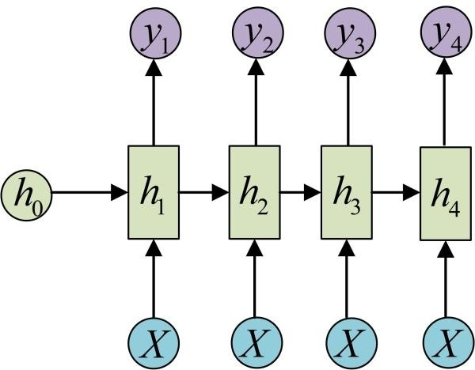

# Recurrent Neural Network

  循环神经网络（Recurrent Neural Network）是一类用于处理序列数据的神经网络。就像卷积网络是专门用于处理玩家给个话数据的神经网络，循环神经网络是专门用于处理序列$x^{(1)},\ldots,x^{(\tau)}$，尤其是时间序列的神经网络。正如卷积网络可以很容易地拓展到具有很大宽度和高度的图像，以及处理大小可变的图像，循环网络可以拓展到更长的序列（比不基于序列的特化网格长得多）。大多数循环网络也能处理可变长度的序列。

## 循环神经网络

  循环神经网络中一些重要的设计模式包括以下几种：

1. 每个时间点都有输出，并且隐藏单元之间有循环连接的循环网络。
2. 每个时间点都产生一个输出，只有当前时刻的输出到下个时刻的隐藏单元之间有循环连接的循环网络。
3. 隐藏单元之间存在循环连接，但读取整个序列后产生单个输出的循环网络。

<center>    
        
    <br>    
    <div style="color:orange; border-bottom: 1px solid #d9d9d9;
    display: inline-block;
    color: #999;
    padding: 2px;">
        图1.第一种设计模式
    </div> 
</center>

  上图是计算循环网络（将$x$值得输入学列映射到输出值$o$得对应序列）训练损失的计算图。损失$L$衡量每个$o$与相应的训练目标$y$的距离。当使用$softmax$输出时，我们假设$o$是未归一化的对数概率。损失$L$内部计算$\hat{y}=softmax(o)$，并将其与目标$y$比较。$RNN$输入到隐藏的连接由权重矩阵$U$参数化，隐藏到隐藏的循环连接由权重矩阵$W$参数化以及隐藏到输出的连接由权重矩阵$V$参数化。

  图中，每一个箭头都代表一次变换，也就是说箭头连接带有权值。左侧是计算图，是一种省略的表示形式，而右侧则是展开计算图，对展开递归或循环计算得到的重复结构进行解释。而且在训练中有个特点是，图中的所有权重都是共享的，也就是说不存在在不同节点下的不同权重值。

  而且，$RNN$的输入输出形式有很多样式，上面的图是最简单的形式，下面展示的是多种不同的$RNN$变种结构形式。

<center>    
      
       
      
    
    
    <br>  
    <div style="color:orange; border-bottom: 1px solid #d9d9d9;
    display: inline-block;
    color: #999;
    padding: 2px;">
        图2.多种设计模式
    </div>
</center>

### 前向传播公式

  图1中没有指定隐藏单元的激活函数，假设使用双曲正切激活函数。此外，图中没有明确指定何种形式的输出和损失函数，所以整个公式都将使用一般形式来表达。假定输出是离散的，表示离散变量的常规方式是把输出$o$作为每个离散变量可能值得非标准化对数概率。然后，我们可以应用$softmax$函数后续处理后，获得标准化后概率得输出向量$\hat{y}$。$RNN$从特定的初始状态$h_0$开始前向传播。从$t=1$到$t=\tau$得每一个时间步，在每一个时间步中，取一个输入$x_i$和前一个节点的输出$a_{i-1}$，对其进行计算，并生成一个输出$h_i$,这个输出被取出来之后，再提供给下一个节点，此过程一直继续，指导所有时间步都被计算完成。我们应用一下更新方程：
$$
\begin{align}
	a_t &=f(h_{t-1},x_t)=W\cdot h_{t-1}+U\cdot x_t+b \tag{1}\\
	h_t &=tanh(a_t) \tag{2}\\
	o_t &=V\cdot h_t +c\tag{3}\\
	\hat{y}_t &= softmax(o_t)\tag{4}
\end{align}
$$
  这个循环网络将一个输入序列映射到相同形式得输出序列。与输入序列匹配的输出的总损失就是所有时间序列中的损失之和。关于各个参数来计算一个损失函数的梯度是计算成本很高的操作。梯度计涉及了执行一次前向传播，接着是反向传播。总的运行时间是$O(2\tau)$,反向传播计算的时间是一半，也就是$O(\tau)$，并且不能通过并行化来降低，因为前向传播图是固有循序的，每个时间步都只能一前一后地计算。而且，前向传播中计算得到的各个状态必须保存，指导他们反向传播中被再次用到，因此内存代价是$O(\tau)$。因此，应用于展开图而且代价为$O(\tau)$的反向传播算法称为**通过时间反向传播（Back-Propagation Through Time, BPTT）**。

  所以，隐藏单元之间如果存在循环的网络将会非常强大，但是训练代价也会非常大。接下来，对于训练方法的选择中除了上面提到的**BPTT**算法之外，还有另外一种较**Teacher Forcing**的算法，主要就是对所有时间都进行解耦，能够用并行化处理梯度，这里只是起到一个抛砖引玉的作用，后面的知识和这个关系不大，便不再描述。

### 计算循环神经网络的梯度

  为了获得**BPTT**算法行为的一些直观上的理解，对于计算公式（1）和损失函数的梯度，再次把下图搬上来了。

<center>    
        
    <br>    
    <div style="color:orange; border-bottom: 1px solid #d9d9d9;
    display: inline-block;
    color: #999;
    padding: 2px;">
        图3.再次搬上来的第一种设计模式
    </div> 
</center>

  对于每一个节点**N**，我们需要基于**N**后面的节点的梯度，递归地计算梯度$\nabla_NL$。我们从紧接着最终损失的节点开始递归：
$$
\frac{\part L}{\part L_t} = 1 \tag{5}
$$
  对于$\forall i,t$，关于时间步$t$输出的梯度$\nabla_NL$如下：
$$
(\nabla_{o_t}L)_i=\frac{\part L}{\part o_{i,t}}=\frac{\part L}{\part L_t}\frac{\part L_t}{\part o_{i,t}}=\hat{y}_{i,t}-y_t
$$
  上面的式子就是简单的反推，正常损失函数是输出和理想情况的差值，那么对于$\hat{y}_t = softmax(o_t)$来讲，损失函数对于输出的推导就是差值。在学习的过程中，我对于上式有很大的不解，所以列出了我理解的过程，如有纰漏，请指正。
$$
\begin{align}
L_T &= -[y_t\cdot log\space\sigma(o_t)+(1-y_t)\cdot log\space\sigma(1-o_t)]\tag{6}\\
\sigma(o_t)'&=\sigma(o_t)\cdot(1-\sigma(o_t))=\sigma(o_t) - \sigma(o_t)^2\tag{7}\\
\frac{L_t}{o_t}&=\frac{L_t}{\sigma(o_t)}\cdot\frac{\sigma(o_t)}{o_t}\\
&=-[y_t\cdot\frac{1}{\sigma(o_t)-\sigma(o_t)^2}-\frac{1}{1-\sigma(o_t)}]\cdot[\sigma(o_t) - \sigma(o_t)^2]\\
&=-[y_t-\sigma(o_t)]=\hat{y}_{i,t}-y_t\tag{8}
\end{align}
$$

  接着，从序列的末尾开始，反向进行计算。在最后的时间点$\tau$，$h_\tau$只有$o_\tau$作为后续节点，因此这个梯度很简单：
$$
\nabla_{h_\tau}L = V^T\nabla_{o_\tau}L\tag{9}
$$
  然后，可以从时刻$t=\tau-1$到$t=1$进行反向迭代，通过实践反向传播梯度，注意$h_t(t<\tau)$同时具有$o_t$和$h_{t+1}$两个后续节点。因此，他的梯度由下式计算。
$$
\begin{align}
\nabla_{h_t}L&=(\frac{\part h_{t+1}}{\part h_t})^T(\nabla_{h_{t+1}}L)+(\frac{\part o_t}{\part h_t})^T(\nabla_{o_t}L)\\
&=W^T(\nabla_{h_{t+1}}L)diag(1-(h_{t+1})^2)+V^T(\nabla_{o_t}L)
\end{align}\tag{10}
$$
  一旦获得了计算图内部节点的梯度，我们就可以得到关于参数节点的梯度。因为参数在许多时间点共享，所以为了消除歧义，可以使用$\nabla_{W_t}$表示权重在时间点$t$对梯度的贡献。使用这个表示，关于剩下参数的梯度可以用以下式子表示：
$$
\begin{align}
\nabla_cL&=\sum_t(\frac{\part o_t}{\part c})^T\nabla_{o_t}L=\sum_t\nabla_{o_t}L \tag{11} \\
\nabla_bL&=\sum_t(\frac{\part h_t}{\part b_t})^T\nabla_{h_t}L=\sum_tdiag(1-(h_t)^2)\nabla_{h_t}L \tag{12}\\
\nabla_VL&=\sum_t\sum_i(\frac{\part L}{\part o_t})\nabla_{V}o_{i,t}=\sum_t(\nabla_{o_t}L)h_t^T \tag{13} \\
\nabla_WL&=\sum_t\sum_i(\frac{\part L}{\part h_{i,t}})\nabla_{W_t}h_{i,t}\\
&=\sum_tdiag(1-(h_t)^2)(\nabla_{h_t}L)h_{t-1}^T \tag{14}\\
\nabla_UL&=\sum_t\sum_i(\frac{\part L}{\part h_{i,t}})\nabla_{U_t}h_{i,t}\\
&=\sum_t diag(1-(h_t)^2)(\nabla_{h_t}L)x_t^T\tag{15}
\end{align}
$$
  上述的整个推导过程，要时刻关注公式（1）（2）（3）（4），因为整个梯度过程都会围绕上述公式来完成。因为计算图中定义的损失的任何参数都不是训练数据$x_t$的父节点，所以不需要计算关于它的梯度。所以，在上式的基础上，可以写出相应的`python`代码：

```python
class RNN(object):   # object need to define the RNN before to use it at this code.
    # activate function
    def activate(self, x):
        return 1 / (1 + np.exp(-x))

    # Softmax function: transfer function
    def transform(self, x):
        safe_exp = np.exp(x - np.max(x))
        return safe_exp / np.sum(safe_exp)

    def bptt(self, x, y):
    	#input & output & length
        x, y, n = np.asarray(x), np.asarray(y), len(y)
        y_hat = self.run(x)
        
        dis = y_hat - y
        dv = dis.T.dot(self._states[:-1])
        du = np.zeros_like(self._u)
        dw = np.zeros_like(self._w)
        for t in range(n-1, -1, -1):
            st = self._states[t]
            ds = self._v.T.dot(dis[t]) * st * (1 - st)
            
            for bptt_step in range(t, max(-1, t-10), -1):
                du += np.outer(ds, x[bptt_step])
                dw += np.outer(ds, self._states[bptt_step-1])
                st = self._states[bptt_step-1]
                ds = self._w.T.dot(ds) * st * (1 - st)
        return du, dv, dw

    def loss(self, x, y):
        y_hat = self.run(x)
        return np.sum(
            -y * np.log(np.maximum(y_hat, 1e-12)) -
            (1 - y) * np.log(np.maximum(1 - y_hat, 1e-12))
        )
```

## 长短期记忆模型（LSTM）

  Long Short Term Memory networks(LSTM)是一种RNN的特殊类型，其利用了特殊的设计手段能够避免长期依赖问题，也就是当前时间点的输出需要依赖一定过去时间点的输出或状态。首先，LSTM同样是RNN一样的结构，但是重复的模块拥有一个不同的结构。

  若要理解LSTM，下图足以说明所有的关键点。所以将对下图进行主要对分析。

<center>    
        
    <br>    
    <div style="color:orange; border-bottom: 1px solid #d9d9d9;
    display: inline-block;
    color: #999;
    padding: 2px;">
        图4.LSTM框图
    </div> 
</center>

  LSTM的框架是基于RNN完成的，所以大致的框架没有变，都是由输入层、隐藏层和输出层构成的，那么LSTM是如何解决长期依赖的问题的呢？从图中可以看出隐藏层分类了两条主线。其中，上面的主线是用来解决长期依赖的问题，也就是用来存储`Cell State`的主线，`x`是遗忘门，表示的是数据的删除；而`+`是记录门，表示的是数据的添加，那么整个主线都会在数据上进行删除和添加，解决了长期依赖问题。而另一条主线则和隐藏层大致相同。接下来，按步骤对其进行分解。

### LSTM分解

* 决定丢弃的信息（forget）

<center>    
        
    <br>    
    <div style="color:orange; border-bottom: 1px solid #d9d9d9;
    display: inline-block;
    color: #999;
    padding: 2px;">
        图5.决定丢弃的信息
    </div> 
</center>

$$
\begin{align}
f_t &= \sigma(W_f\cdot[h_{t-1},x_t]+b_f)\\
x_t&\in R^d\\
h_{t-1}&\in R^m\\
W_f&\in R^{n\times(m+d)}\\
b_f&\in R^n
\end{align}\tag{16}
$$

  计算得到的是需要进行数据遗弃的比例$f_t$,$\sigma(·)$函数是激活函数，当输出`1`到遗忘门的时候，就是全部保留，输出`0`的时候就是全部遗弃。

* 决定存储的信息（memory）

<center>    
        
    <br>    
    <div style="color:orange; border-bottom: 1px solid #d9d9d9;
    display: inline-block;
    color: #999;
    padding: 2px;">
        图6.决定保留的信息
    </div> 
</center>

$$
\begin{align}
i_t &= \sigma(W_i\cdot[h_{t-1},x_t]+b_i)\\
\tilde{C}_t &= tanh(W_c\cdot[h_{t-1},x_t]+b_c)\\
x_t&\in R^d\\
h_{t-1}&\in R^m\\
W_i &\in R^{n\times(m+d)}\\
\tilde{C}_t &\in R^n\\
b_i,b_c &\in R^n
\end{align}\tag{17}
$$

  这一步中确定的是需要存储在细胞状态中的新信息，这里包含两个部分。第一，$\sigma(·)$层,"输入门层"决定多少比例的新数据需要更新。然后，一个$tanh(·)$层创建一个新的候选值向量$\tilde{C}_t$用于被选择。

* 更新细胞状态

<center>    
        
    <br>    
    <div style="color:orange; border-bottom: 1px solid #d9d9d9;
    display: inline-block;
    color: #999;
    padding: 2px;">
        图7.更新细胞状态
    </div> 
</center>

$$
\begin{align}
C_t=f_t\cdot C_{t-1} + i_t\cdot \tilde C_t \tag{18}
\end{align}
$$

  过去的状态$C_{t-1}$与系数$f_t$相乘获得想要保存的数据状态，当前计算的候选值状态$\tilde{C}_t$乘上$i_t$系数获得想要保存的新数据，两者相加就是决定更新的细胞状态。

* 一次输出

<center>    
        
    <br>    
    <div style="color:orange; border-bottom: 1px solid #d9d9d9;
    display: inline-block;
    color: #999;
    padding: 2px;">
        图8.输出
    </div> 
</center>

$$
\begin{align}
o_t &= \sigma(W_o\cdot [h_{t-1},x_t]+b_o)\\
h_t &= o_t \cdot tanh(C_t)
\end{align} \tag{19}
$$

  最终，在每一个计算的序列点上将会基于我们的细胞状态有一个输出，但是也是一个过滤后的输出。这个过滤的过程，首先是通过$\sigma(·)$函数确定一个系数来决定细胞状态的哪个部分将输出出去。接着，把细胞状态通过$tanh(·)$函数进行处理并将它和系数相乘决定输出确定输出的那一部分。

